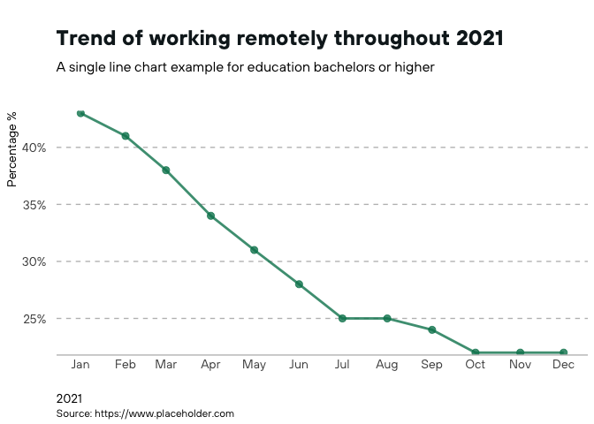
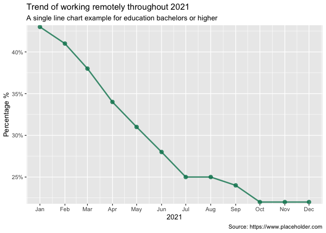

<!-- README.md is generated from README.Rmd. Please edit that file -->

# coriplot

Additional Themes and Theme Components for ‘ggplot2’ along with
additional utility functions for the [Center On Rural
Innovation](https://ruralinnovation.us/).

<!-- badges: start -->

[](https://github.com/Dashansh/coriplot/actions/workflows/check-standard.yaml)
<!-- badges: end -->

## Overview

The `coriplot` package is a dedicated visualization toolkit designed
specifically for the [Center On Rural
Innovation](https://ruralinnovation.us/). The package extends ggplot2
with customized themes that are in accordance with the CORI Branding
Guidelines with the aim of seamless standardization across multiple
visuals. Additionally, the package sees added support for a set of
utility tools to be used by CORI such as adding thresholds with/without
annotations, adding watermarks, and more.

A comprehensive set of examples is available in the [Getting
Started](https://dashansh.github.io/coriplot/articles/coriplot.html)
section of this website.

## Installation

You can install the development version of coriplot from
[GitHub](https://github.com/) with:

``` r
# install.packages("devtools")
devtools::install_github("Dashansh/coriplot")
```

## Example

This is a basic example which shows you how to solve a common problem.
We plot a single line showing the percentage of remotely working users
with education equal to a bachelors degree or higher.

``` r
set_cori_geom_defaults()
fig+theme_cori()
```



This same graph without the CORI theme to highlight the cori theme
customisations.

``` r
fig
```


