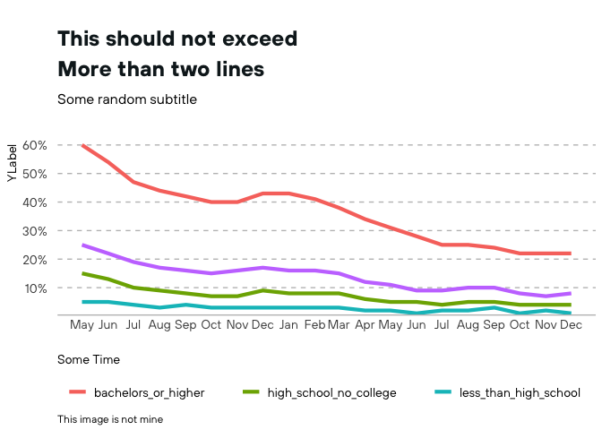

<!-- README.md is generated from README.Rmd. Please edit that file -->

# coriplot

<!-- badges: start -->

[](https://github.com/Dashansh/coriplot/actions/workflows/check-standard.yaml)
<!-- badges: end -->

The goal of coriplot is to …

## Installation

You can install the development version of coriplot from
[GitHub](https://github.com/) with:

``` r
# install.packages("devtools")
devtools::install_github("Dashansh/coriplot")
```

## Example

This is a basic example which shows you how to solve a common problem:
Dashanh’s workspace

``` r
library(ggplot2)
library(dplyr)
#> 
#> Attaching package: 'dplyr'
#> The following objects are masked from 'package:stats':
#> 
#>     filter, lag
#> The following objects are masked from 'package:base':
#> 
#>     intersect, setdiff, setequal, union
library(coriplot)

theme_set(theme_cori())
data("remote_work_by_ed_level")
fig <- remote_work_by_ed_level %>%
  ggplot(aes(as.Date(date),
             pct_working_remotely,
             group = education_level,
             color = education_level)) +
  geom_line(lwd = 1.5) +
  xlab("Some Time") +
  ylab("YLabel") +
  labs(title = "This should not exceed\nMore than two lines",
       subtitle = "Some random subtitle",
       caption = "This image is not mine") +
  scale_x_date(date_breaks = "1 month", date_labels =  "%b") + 
  scale_y_continuous(expand = c(0, 0), limits = c(0,NA)) +
  theme_cori()+
  scale_y_percent()
#> Scale for 'y' is already present. Adding another scale for 'y', which will
#> replace the existing scale.

fig
```


