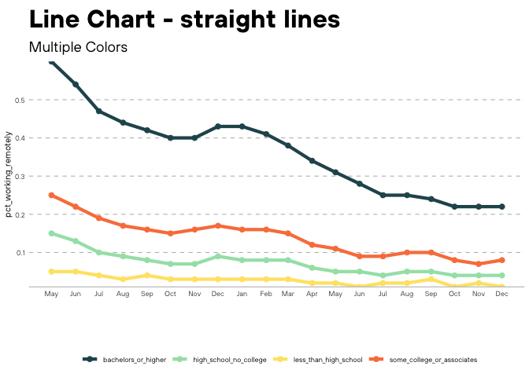

<!-- README.md is generated from README.Rmd. Please edit that file -->

# coriplot

<!-- badges: start -->

[](https://github.com/Dashansh/coriplot/actions/workflows/check-standard.yaml)
<!-- badges: end -->

The goal of coriplot is to …

## Installation

You can install the development version of coriplot from
[GitHub](https://github.com/) with:

``` r
# install.packages("devtools")
devtools::install_github("Dashansh/coriplot")
```

## Example

This is a basic example which shows you how to solve a common problem:
Dashanh’s workspace

``` r
library(ggplot2)
library(tidyverse)
#> ── Attaching packages ─────────────────────────────────────── tidyverse 1.3.1 ──
#> ✓ tibble  3.1.6     ✓ dplyr   1.0.8
#> ✓ tidyr   1.2.0     ✓ stringr 1.4.0
#> ✓ readr   2.1.2     ✓ forcats 0.5.1
#> ✓ purrr   0.3.4
#> ── Conflicts ────────────────────────────────────────── tidyverse_conflicts() ──
#> x dplyr::filter() masks stats::filter()
#> x dplyr::lag()    masks stats::lag()
library(coriplot)

theme_set(theme_cori())
data("remote_work_by_ed_level")
fig <- remote_work_by_ed_level %>%
  ggplot(aes(as.Date(date),
             pct_working_remotely,
             group = education_level,
             color = education_level)) +
  geom_line(lwd = 1.5) +
  xlab("Some Time") +
  ylab("YLabel") +
  labs(title = "This should not exceed\nMore than two lines",
       subtitle = "Some random subtitle",
       caption = "This image is not mine") +
  scale_x_date(date_breaks = "1 month", date_labels =  "%b %Y") + 
  scale_y_continuous(expand = c(0, 0), limits = c(0,NA)) +
  theme_cori()+
  scale_y_percent()
#> Scale for 'y' is already present. Adding another scale for 'y', which will
#> replace the existing scale.

fig
```


abhishek’s workspace

``` r
fig <- remote_work_by_ed_level %>%
  ggplot(aes(as.Date(date), pct_working_remotely, group = education_level, color = education_level)) +
  geom_line(lwd = 1.5) +
  xlab("") +
  scale_x_date(date_breaks = "1 month", date_labels =  "%b") + 
  scale_y_continuous(expand = c(0, 0)) +
  geom_point(size = 2)+
  ggtitle("Line Chart - straight lines") +
  labs(subtitle = "Multiple Colors")+
  scale_color_cori() 

flush_ticks(fig)#fig 
#> theme(axis.text.x=element_text(hjust=c(0, rep(0.5, 18), 1))) +
#> theme(axis.text.y=element_text(vjust=c(0, rep(0.5, 3), 1)))
```



``` r
twoColDf<-time_series_sample_data[,c("date","less_than_high_school","high_school_no_college")]
colnames(twoColDf)<-c("date","urban","rural")
df2col<- tidyr::pivot_longer(
  twoColDf,
  cols = !date,
  names_to = "education_level",
  values_to = "pct_working_remotely"
)

fig <- df2col %>%
  ggplot(aes(as.Date(date), pct_working_remotely, group = education_level, color = education_level)) +
  geom_line(lwd = 1.5) +
  xlab("") +
  scale_x_date(date_breaks = "1 month", date_labels =  "%b") + 
  scale_y_continuous(expand = c(0, 0)) +
  geom_point(size = 2)+
  ggtitle("Line Chart - straight lines") +
  labs(subtitle = "Only 2 Columns")+
  ylab("Percentage Working Remotely")+
  scale_color_cori(cori_primary) 
fig 
```


This is a basic example which shows you how to make curved lines:

``` r
library(ggplot2)
library(tidyverse)

fig <- remote_work_by_ed_level[1:20,] %>%
  ggplot(aes(as.Date(date),
             pct_working_remotely,
             group = education_level,
             color = education_level)) +
  geom_smooth(method = 'loess',
              linetype = 1,
              size = 1,
              lwd = 1.5,
              se= FALSE) +
  xlab("") +
  scale_x_date(date_breaks = "1 month", date_labels =  "%b") + 
  scale_y_continuous(expand = c(0, 0)) +
  geom_point(size = 2)+
  ggtitle("Line Chart - Curved lines")+
  labs(subtitle = "Multiple Colors")+
  scale_color_cori(cori_primary) 
fig 
#> `geom_smooth()` using formula 'y ~ x'
```


